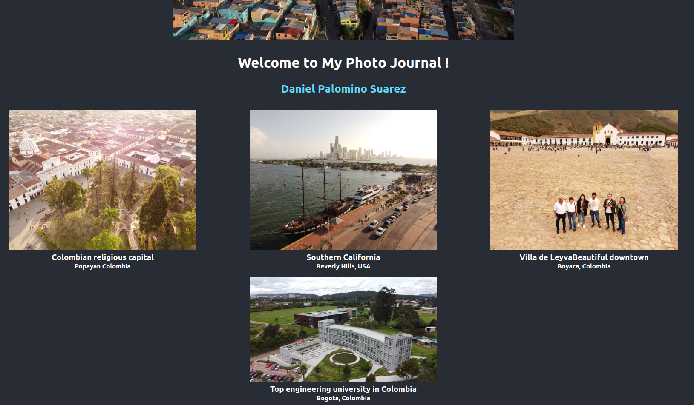

# Getting Started with Create React App
A basic introductory react project to render a photojournal.

It covers basic react topics including components, style, library management and modularity.

This project was bootstrapped with [Create React App](https://github.com/facebook/create-react-app).

